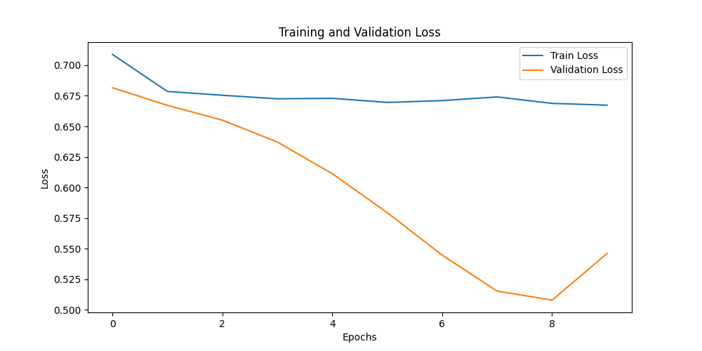
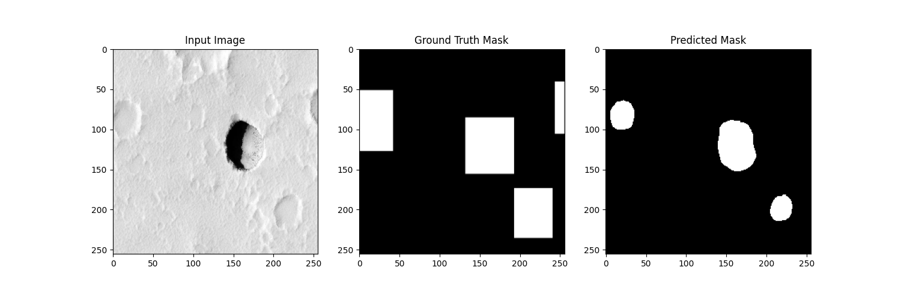
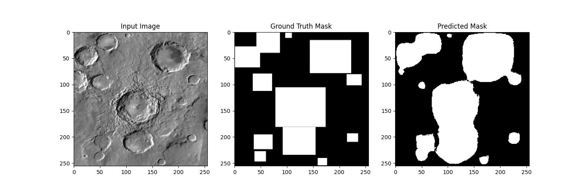

# ConVNet_scratch
Exploring the modern Convnet architecture in the detection task. 

I am using the open sourced Mars and Moon crater dataset: https://www.kaggle.com/datasets/lincolnzh/martianlunar-crater-detection-dataset

The architecture I am planning to explore is:
1. AutoEncoder
2. UNet
3. YOLO
4. EfficientNet
5. Faster-RCNN
6. DETR (DEtection TRansformer)

Except for YOLO, I am trying to make some of their parts from scratch for the better understanding.

## Running EDA.ipynb
To organize the directory and perform exploratory data analysis (EDA), follow these steps:

1. Open the `EDA.ipynb` notebook located in the `notebooks/` directory.
2. Run the cells in the notebook sequentially to load and preprocess the data.
3. The notebook will automatically organize the data into the appropriate directories (`train/`, `val/`, `test/`).

## Directory Structure

The data directory should be organized as follows after running EDA.ipynb:

```
ROOT
├── assets/
│   ├── Loss.png
│   ├── Good_dice.png
│   └── Good_result.png
├── data/
│   ├── train/
│   ├── val/
│   └── test/
│   └── mask/
│       │└── test/
│       │└── train/
│       │└── valid/
```

## Notable results:

### UNet:
Not suprisingly, the pretrained model in smp library is giving the best results. I tried the hybrid Unet using autoencoder and UNet decoder from scratch, but the results were not great. 
The training loss and val loss change over 10 epochs. More traiings may result in good results.



An inference result with 78% dice score.


An inference result with the least validation loss.

